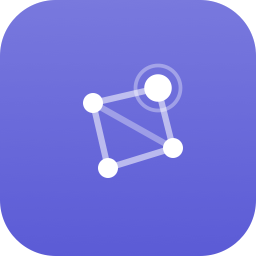
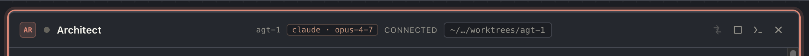
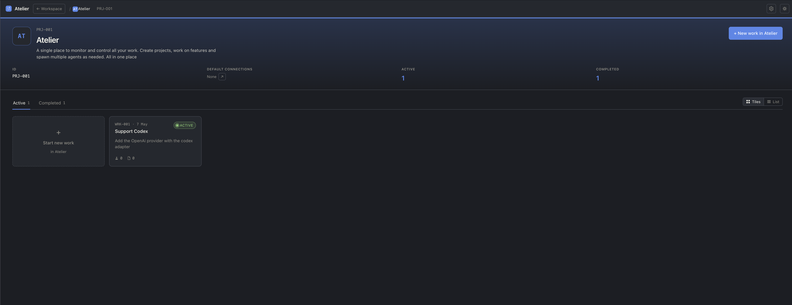

<p align="center">
  
</p>

<h1 align="center">Atelier</h1>

<p align="center">
  Run a small team of AI agents on a real task — across providers, with full
  history, without losing your place when you switch to the terminal.
</p>

<p align="center">
  
</p>

---

## Why

You probably already use Claude Code, Amp, or a similar CLI. They're great. But:

- Each agent lives in its own terminal. Tracking five concurrent conversations
  means five tabs and a memory of which one was doing what.
- Providers don't talk to each other. If today's task wants Claude's reasoning
  *and* Amp's tooling, you bounce between two apps.
- The CLI is great for deep work — a UI is better for *"what are all my agents
  doing right now?"*
- The moment you exit the CLI, that conversation is over. Resuming usually
  means losing the live thread.

Atelier is a workspace that wraps these tools instead of replacing them.

## What you get

### One workspace, many agents

Group agents into a **Work unit** — a single goal like *"STORY-018 connections
page"* — and watch them in parallel. Each tile is one agent, streaming live.
Pin tiles to a rail when you want them out of the way; bring them back without
losing the conversation.

<p align="center">
  
</p>

### Multi-provider

Claude (via the SDK) and Amp (via the CLI) are both first-class. Pick a
provider per agent — one persona on Claude, another on Amp — and they share
the same Work unit, the same context, the same transcript log.

### Detach to CLI, come back seamlessly

Sometimes the UI gets in the way. Click **Detach**: Atelier stops the SDK
process, opens your terminal with the provider's resume command, and hands
the agent over. Work in the CLI as long as you want. When you're done, the
agent reattaches in Atelier with the full transcript intact — including
everything that happened in the terminal.

<p align="center">
  
</p>

<p align="center">
  <video src="https://github.com/user-attachments/assets/97d23025-be69-4fcd-94da-e7209c7e7423" controls muted width="900">
    Detach flow demo — your browser couldn't play this inline.
  </video>
</p>

### Source-backed context

Plug in your Jira, Sentry, or Honeycomb credentials once. Pull a ticket, an
error, or a trace into an agent's starting context — Atelier fetches the full
payload and renders it as a context file the agent reads on its first turn.
Add more context mid-session without restarting.

<p align="center">
  
</p>

### Per-agent git worktrees

Atelier provisions a separate `git worktree` per agent automatically. Two
agents on the same repo don't step on each other's branches. When you're done,
the worktrees are still there for review.

### Persistent everything

Close a tile, restart the backend, reboot your machine — the transcripts are
on disk (one NDJSON per agent), the SQL index gets reconciled against them on
startup, and the next time you open the agent the conversation picks up
exactly where it left off.

### Optional projects

Long-running effort? Wrap a set of Work units in a **Project** with a glyph
and a hue. Per-project default connections, filtered work feeds, and a
project home page that scopes everything to that effort.

<p align="center">
  
</p>

<p align="center">
  
</p>

## Quick start

You'll need **Python 3.11+**, **Node 18+**, and [`uv`](https://docs.astral.sh/uv/)
for the backend env.

```sh
git clone https://github.com/sebastiandev/atelier.git
cd atelier
./scripts/dev.sh
```

The frontend serves at `http://127.0.0.1:4173`, the backend API at
`http://127.0.0.1:8001`.

### One-click desktop launcher

Prefer double-clicking an app icon over typing a script?

```sh
# macOS / Linux
./scripts/install-launcher.sh

# Windows (PowerShell, requires Git Bash on PATH)
powershell -ExecutionPolicy Bypass -File scripts\install-launcher.ps1
```

This drops an `Atelier.app` (macOS), `atelier.desktop` entry (Linux), or
Start Menu + Desktop shortcut (Windows) that launches the dev servers in a
terminal window.

## Status

Atelier is early. The core loops — multi-agent Work units, multi-provider,
detach/resume, connection-backed context — are working. Lots of polish and
feature surface still ahead; expect rough edges, but the workflow is real.

## Going deeper

The codebase has its own developer docs in [`docs/`](docs/):

| Doc | Scope |
| --- | --- |
| [`architecture.md`](docs/architecture.md) | Clean architecture layers, the command pattern |
| [`backend.md`](docs/backend.md) | Supervisor model, persistence, WS protocol |
| [`frontend.md`](docs/frontend.md) | Routing, state, the agent stream hook |
| [`design-system.md`](docs/design-system.md) | Tokens, brand mark, visual conventions |
| [`api-flows.md`](docs/api-flows.md) | Sequence diagrams per endpoint |

For AI assistants working on the codebase, see [`CLAUDE.md`](CLAUDE.md).

## License

[MIT](LICENSE) — use it, fork it, ship it. Attribution appreciated, not required beyond what the license itself asks for.
