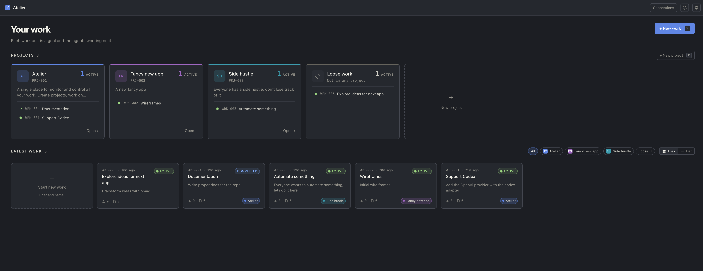
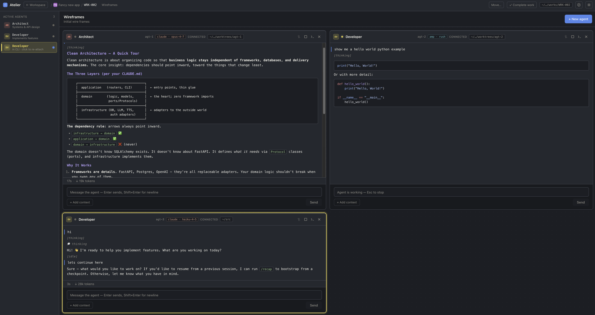
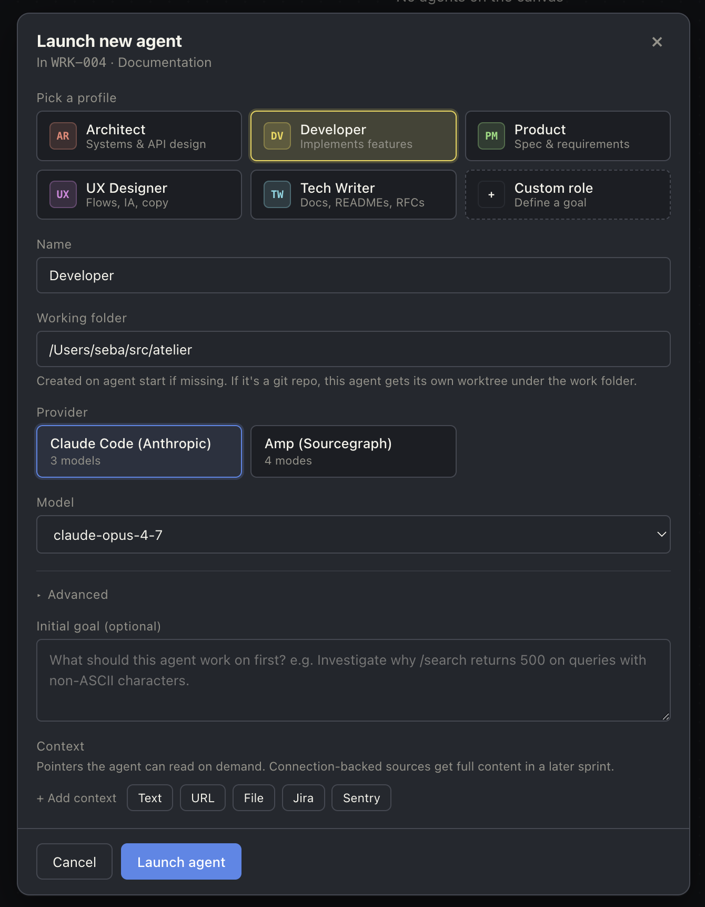
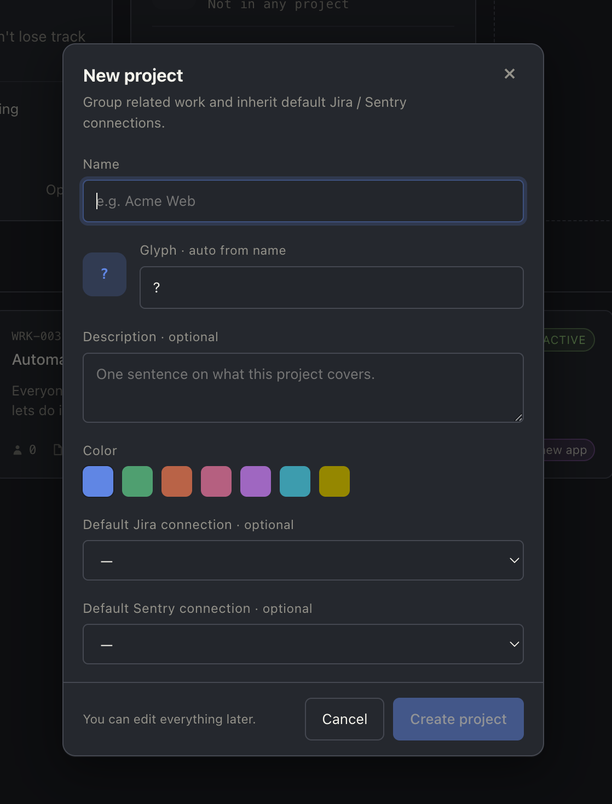

<p align="center">
  <picture>
    <source media="(prefers-color-scheme: dark)" srcset="brand/atelier-mark-light.svg">
    
  </picture>
</p>

<h1 align="center">Atelier</h1>

<p align="center">
  A centralised workspace for all the work you do with AI agents — no matter which agents you use.
</p>

<p align="center">
  Organise, track, and improve how you coordinate them. Atelier handles the orchestration: source-backed context, agent-to-agent handoff, isolated per-agent worktrees, and automatic artifact tracking (PRs, Jira tickets, docs). When you need to drop into the CLI, sessions stay in sync — pick up exactly where you left off, in either direction.
</p>

<p align="center">
  
</p>


---

## Contents

- [Quick start](#quick-start) — clone, run, open in your browser
- [Install as a desktop app](#install-as-a-desktop-app-pwa) — Chrome / Safari / Edge / Firefox
- [What you get](#what-you-get) — feature gallery
- [Working on Atelier](#working-on-atelier) — first-time setup, dev loop, updating, wipe
- [Skills for contributors](#skills-for-contributors) — `/update`, `/migrate`, `/test`, `/dev`, `/wipe`, `/new-migration`
- [Going deeper](#going-deeper) — developer docs index
- [One-click desktop launcher](#one-click-desktop-launcher) — macOS / Linux / Windows
- [Status](#status) — what's working, what's rough
- [License](#license) — FSL-1.1-ALv2

## Quick start

You'll need **Python 3.11+**, **Node 18+**, and [`uv`](https://docs.astral.sh/uv/) for the backend env.

```sh
git clone https://github.com/sebastiandev/atelier.git
cd atelier
./scripts/dev.sh
```

Frontend serves at `http://127.0.0.1:4173`, backend API at `http://127.0.0.1:8001`.

## Install as a desktop app (PWA)

You can turn the Atelier tab into a standalone app window — no address bar, its own Dock / Taskbar icon, opens in one click. Atelier is just a local web app, so any modern browser's "install" or "create shortcut" flow works.

- **Chrome / Edge / Brave / Arc** — open `http://127.0.0.1:4173`, then **⋮ menu → Cast, save and share → Install page as app…** (older Chrome: *More tools → Create shortcut…*, tick **Open as window**). The app shows up in `~/Applications/Chrome Apps` on macOS and in the Start menu on Windows.
- **Safari (macOS 14 Sonoma+)** — open Atelier, then **Share button (square with arrow up) in the toolbar → Add to Dock**. Pins it to your Dock; click to launch in a standalone window.
- **Vivaldi** — right-click the Atelier tab → **Progressive Apps → Install Atelier as a Progressive Web Application**. Vivaldi launches it in its own window with its own taskbar icon, no browser chrome.
- **Firefox (desktop)** — Firefox doesn't ship PWA install on desktop. Workarounds: the [`PWAsForFirefox`](https://github.com/filips123/PWAsForFirefox) extension, or just use the [desktop launcher](#one-click-desktop-launcher) below which gives you a `.app` / `.desktop` / `.lnk` shortcut that boots both servers and opens the page.

Tip: start `./scripts/dev.sh` from your `~/.zshrc` / startup folder so the backend is always up when you click the app icon.

## What you get

A quick tour of the surface area:

- [One workspace, many agents](#one-workspace-many-agents) — Work units with live tiles
- [Exploratory chats](#exploratory-chats) — think through ideas before committing to work
- [Multi-provider](#multi-provider) — Claude and Amp side-by-side
- [Detach to CLI](#detach-to-cli-come-back-seamlessly) — terminal handoff with full resume
- [Hand off to a new agent](#hand-off-to-a-new-agent) — checkpoint doc + forked worktree
- [Artifact detection](#artifact-detection) — PRs, Jira tickets, docs surface on a rail
- [Re-organize the canvas](#re-organize-the-canvas) — drag tiles into the order you want
- [Maximize a tile](#maximize-a-tile) — zoom one agent to fill the canvas
- [Agent shortcuts](#agent-shortcuts) — per-tile toolbar: detach, hand off, maximize, close
- [Source-backed context](#source-backed-context) — Jira / Sentry / Honeycomb on first turn
- [Per-agent git worktrees](#per-agent-git-worktrees) — automatic, isolated, detached by default
- [Open in your IDE](#open-in-your-ide) — one-click VSCode / Cursor on the worktree
- [Rich tool rendering](#rich-tool-rendering) — paired call+result, syntax-highlighted diffs
- [Persistent everything](#persistent-everything) — transcripts on disk, conversations resume
- [Token + cost rollup](#token--cost-rollup) — context %, session spend, per-tile
- [Provider-agnostic context compaction](#provider-agnostic-context-compaction) — shrink long sessions without switching agents
- [Projects](#projects) — optional grouping with shared defaults

### One workspace, many agents

Group agents into a **Work unit** — a single goal like *"STORY-018 connections
page"* — and watch them in parallel. Each tile is one agent, streaming live.
Pin tiles to a rail when you want them out of the way; bring them back without
losing the conversation.

<p align="center">
  
</p>

### Exploratory chats


Start a chat when you want to think out loud before creating a Work unit.
Chats are useful for shaping a vague idea, asking a few research questions,
or collecting enough context to decide what should happen next.

A chat can stand on its own, or it can be linked to a Project or Work unit so
it appears in the right place. You can also choose a working folder when the
chat needs to look at local files. When the conversation turns into real work,
Atelier can start a Work unit from the chat and carry over a concise summary,
action items, and a link back to the full transcript.

You can also start chats from a work unit. When you dont need worktree isolation
but wan to ground the chat in a git repo, opening a chat is lighter. You can also
spawn new agents from your chat, and they will appear in you canvas.


### Multi-provider

Claude (via the SDK) and Amp (via the CLI) are both first-class. Pick a
provider per agent — one persona on Claude, another on Amp — and they share
the same Work unit, the same context, the same transcript log.

### Detach to CLI, come back seamlessly

Sometimes the UI gets in the way. Click **Detach**: Atelier stops the SDK
process, opens your terminal with the provider's resume command, and hands
the agent over. Work in the CLI as long as you want. When you're done, the
agent reattaches in Atelier with the full transcript intact — including
everything that happened in the terminal.

<p align="center">

https://github.com/user-attachments/assets/398f3e22-9c2a-4cce-9add-cab3b27d7358

</p>

### Hand off to a new agent

When an agent's done its piece — planning's complete, the bug's diagnosed,
the design doc's written — hand the work off to a fresh agent without
losing context. Atelier summarises the source's transcript into a Markdown
checkpoint (goal, decisions, open questions, key files, blockers), then
opens the new-agent dialog pre-filled with the doc as the next agent's
starting context. The new worktree is **forked** from the source's at its
current HEAD with all uncommitted work carried over — detached HEAD, no
auto-branch; you name one when you're ready.

### Artifact detection

Agents announce the things they produce so they surface on the work's
artifact rail — no scrolling through twenty turns of transcript to find the
link the agent dropped earlier. Three artifact types are tracked today:

- **Pull requests** — agents call a dedicated tool with the PR URL and
  metadata. Atelier monitors the PR on GitHub and keeps the artifact
  in sync, updating its status as it moves through `draft → open →
  merged` (or `closed`) — no need to chase it manually.
- **Jira tickets** — URL + title + status (`todo`, `in_progress`,
  `in_review`, `done`, `blocked`).
- **Documents** — markdown notes, ADRs, plans, design docs the agent
  authored in its worktree. The rail row reveals the file in your OS file
  browser when clicked; status (`draft` / `pending` / `committed`) is
  derived from whether the file matches HEAD.

Click any rail entry to open: PRs and tickets open the URL in a new tab;
docs open the local file.

<p align="center">

https://github.com/sebastiandev/atelier/raw/main/docs/screenshots/artifact_detection.mp4

</p>

### Re-organize the canvas

Drag any tile by its header to put your agents in the order that makes
sense for the work. The arrangement is per-work, persisted across reloads,
and the rail mirrors the canvas so both stay in sync.

<p align="center">

https://github.com/user-attachments/assets/491b0e98-505b-4d1c-a02e-49de874770f7

</p>

### Maximize a tile

Click the maximize control on a tile header to zoom that agent to fill the
canvas — handy when you want to read a long transcript or scan a tool's
full output without the other tiles competing for space. Shift+Esc /
Cmd+Esc restores the multi-tile layout.

<p align="center">

https://github.com/user-attachments/assets/dc22bbe0-60d8-4a04-9730-df4e4069be7e

</p>

### Agent shortcuts

Atelier surfaces a small set of actions in the agent toolbar:
 - **Detach** — detach the agent to the CLI
 - **Hand off** — hand off to a new agent
 - **Open in console** — open the agent's worktree in your terminal
 - **Open in editor** — open the agent's worktree in your editor
 - **Maximize** — zoom the agent to fill the canvas
 - **Close** — pin the agent to the rail

<p align="center">

https://github.com/user-attachments/assets/014f5121-282b-47ed-a7c0-6c32083a8c14

</p>

### Source-backed context

Plug in your Jira, Sentry, or Honeycomb credentials once. Pull a ticket, an
error, or a trace into an agent's starting context — Atelier fetches the full
payload and renders it as a context file the agent reads on its first turn.
Add more context mid-session without restarting.

<p align="center">
  
</p>

### Per-agent git worktrees

Atelier provisions a separate `git worktree` per agent automatically. Two
agents on the same repo don't step on each other's branches. When you're done,
the worktrees are still there for review.

By default the worktree starts in **detached HEAD** — no auto-named branch
clutters your `git branch` list, and the agent decides on a branch name (or
asks you for one) when there's something worth pushing. The new-agent dialog
has a Branch field if you want to name one upfront, with a picker that shows
existing branches in the source repo. The agent's system prompt warns it not
to `checkout`/`switch` away from a detached worktree without first creating a
branch from current HEAD — that's the only path that orphans commits.

### Open in your IDE

Each agent tile has an "Open in editor" button that opens its worktree in
VSCode or Cursor (`vscode://file/<path>`) — handy when you want to review the
agent's diff in your normal IDE flow without leaving Atelier.

### Rich tool rendering

The transcript collapses each tool call into a one-line summary that actually
tells you something — `▸ Bash · git diff`, `▸ Edit · ~/…/conftest.py · +12 −3`,
`▸ Read · ~/…/foo.py · L1-100`. Edit and MultiEdit calls render the diff
inline with red/green line backgrounds and per-language syntax highlighting;
Bash results that look like a unified diff (e.g. `git diff` output) get the
same treatment. Tool calls and their results are paired into a single card
instead of two siblings, so you read each invocation top-to-bottom.

### Persistent everything

Close a tile, restart the backend, reboot your machine — the transcripts are
on disk (one NDJSON per agent), the SQL index gets reconciled against them on
startup, and the next time you open the agent the conversation picks up
exactly where it left off.

### Token + cost rollup

Each agent tile shows a per-turn rollup at the bottom: turn duration, tokens
this turn, **context % used** of the model's window, and **running session
cost**. Context turns orange at 60% and red at 85% so you know when to compact
or hand off before the next turn squeezes the prompt. Pricing and window come
from the backend's provider spec, so they stay correct as new models are
added — and Opus 4.7 ships with the 1M extended-context tier as the default.
Detached turns count too: when an agent comes back from CLI, the merge pulls
usage off each assistant message so the cost rollup never has gaps.

### Provider-agnostic context compaction

Long sessions eventually fill the provider's context window. Atelier can
compact an agent in place: it summarizes the visible transcript plus the
agent's worktree state, saves that summary under the agent's Atelier folder,
starts a fresh provider session, and keeps the same agent tile, worktree, and
transcript history.

The flow is provider-agnostic. Claude, Amp, and Codex each summarize with the
same provider/model or mode that is being compacted, then start the fresh
session through their own adapter. HTTP calls the compaction command, the
command writes the summary and boundary events, and provider-specific session
mechanics stay behind the adapter port. If provider summary generation fails,
Atelier falls back to its app-level summarizer.

When an agent is compacted again, Atelier does not resummarize the whole
historical transcript. It reads the previous compaction summary and combines it
with only the transcript events after the last compaction boundary, keeping the
summary cumulative without replaying stale context.

After compaction, the transcript shows a clear boundary. The previous session
collapses behind a disclosure, the new session starts below it, and **View
summary** lets you inspect the saved seed context that was used to start the
fresh provider session.

### Projects

Long-running effort? Wrap a set of Work units in an optional **Project**
with a glyph and a hue. Per-project default connections, filtered work
feeds, and a project home page that scopes everything to that effort.

<p align="center">
  
</p>

## Working on Atelier

For contributors making changes — not just running the app.

### First-time setup

After the [Quick start](#quick-start) clone, the first `./scripts/dev.sh` run will:

- Install backend Python deps via `uv` into `backend/.venv` (no `pip install -e` needed; `uv` handles it).
- Install frontend Node deps via `npm install` into `frontend/node_modules/`.
- Initialise the SQLite database at `~/Atelier/atelier.db` and run any pending schema migrations.
- Start backend on `127.0.0.1:8001` and frontend on `127.0.0.1:4173`.

If you want backend or frontend in isolation: `./scripts/dev-backend.sh` or `./scripts/dev-frontend.sh`.

### Daily flow

- **Run dev servers** — `./scripts/dev.sh` (or invoke the `/dev` skill in Claude Code).
- **Run tests** — `cd backend && uv run pytest -q` (or `/test`). The venv lives at `backend/.venv`; always `uv run` or `source backend/.venv/bin/activate` from `backend/` — never use the system Python.
- **Read the docs** — design decisions and conventions live in [`docs/`](docs/) (see [Going deeper](#going-deeper)).

### Updating your checkout

Pulling new commits may bring schema changes (DB migrations auto-run on backend boot) **and** on-disk shape changes (transcript, JSON files — these need explicit migration). The `/update` skill handles both end-to-end:

```
/update
```

That pulls main, runs `uv sync` / `npm install` if lockfiles changed, runs every `scripts/migrate-*.py`, and tells you whether to restart the dev server.

Equivalent manual flow if you don't use Claude Code:

```sh
git pull --ff-only origin main
cd backend && uv sync             # if backend/uv.lock changed
cd ../frontend && npm install     # if frontend/package-lock.json changed
cd .. && for f in scripts/migrate-*.py; do (cd backend && uv run python ../"$f"); done
# then restart ./scripts/dev.sh if backend deps or migrations changed
```

### Wiping local state

Need a clean slate (testing migration paths, debugging stale data, etc.)?

```sh
./scripts/wipe.sh all                  # all works + projects + cleanup
./scripts/wipe.sh work WRK-001         # one work
./scripts/wipe.sh project PRJ-001      # a project + its works
```

The script preserves connections (DB rows + keychain) and `schema_version`. It also handles state outside the workspace dir — pruning stale `git worktree` registry entries in source repos and clearing the Claude SDK's per-session cache at `~/.claude/projects/`. **Stop the backend first** so its in-flight writes don't race the deletes.

The `/wipe` skill wraps this with a backend-stopped check.

## Skills for contributors

When working on Atelier with Claude Code, six project-local skills live under [`.claude/skills/`](.claude/skills/) (committed to the repo, shared across contributors):

| Skill | What it does |
| --- | --- |
| [`/update`](.claude/skills/update/SKILL.md) | Pull main, install deps, run pending migrations, surface what needs a restart. |
| [`/migrate`](.claude/skills/migrate/SKILL.md) | Run all `scripts/migrate-*.py` — FS-side state migrations. (DB schema migrations auto-apply on backend boot.) |
| [`/new-migration`](.claude/skills/new-migration/SKILL.md) | Scaffold a new migration: `db <slug>` for SQL schema; `fs <slug>` for an on-disk shape change. Encodes the "ALTER only, never `.create()`" pitfall. |
| [`/test`](.claude/skills/test/SKILL.md) | Run pytest under the backend venv with optional path/test filter. |
| [`/dev`](.claude/skills/dev/SKILL.md) | Start `./scripts/dev*.sh` with the project's port conventions baked in. |
| [`/wipe`](.claude/skills/wipe/SKILL.md) | Wraps `wipe.sh` with a backend-stopped pre-check. |

Each `SKILL.md` has the full step-by-step the model follows — read them if you want to know exactly what a skill does, or if you want to extend / customise one.

## Going deeper

The codebase has its own developer docs in [`docs/`](docs/):

| Doc | Scope |
| --- | --- |
| [`architecture.md`](docs/architecture.md) | Clean architecture layers, the command pattern |
| [`backend.md`](docs/backend.md) | Supervisor model, persistence, WS protocol, `TurnMetrics` semantics |
| [`frontend.md`](docs/frontend.md) | Routing, state, the agent stream hook |
| [`design-system.md`](docs/design-system.md) | Tokens, brand mark, visual conventions |
| [`api-flows.md`](docs/api-flows.md) | Sequence diagrams per endpoint |

For AI assistants working on the codebase, see [`CLAUDE.md`](CLAUDE.md) — it covers the architecture rules, the backward-compatibility contract, and the project conventions every change should respect.

## One-click desktop launcher

Prefer double-clicking an app icon over typing a script?

```sh
# macOS / Linux
./scripts/install-launcher.sh

# Windows (PowerShell, requires Git Bash on PATH)
powershell -ExecutionPolicy Bypass -File scripts\install-launcher.ps1
```

This drops an `Atelier.app` (macOS), `atelier.desktop` entry (Linux), or
Start Menu + Desktop shortcut (Windows) that launches the dev servers in a
terminal window.

## Status

Atelier is early. The core loops — multi-agent Work units, multi-provider,
detach/resume, connection-backed context — are working. Lots of polish and
feature surface still ahead; expect rough edges, but the workflow is real.

## License

[Functional Source License, Version 1.1, Apache 2.0 Future License](LICENSE)
(FSL-1.1-ALv2). Plain English: use it, fork it, modify it, run it at work,
build on top of it. The one thing you can't do is package it as a competing
commercial product or hosted service. Two years after each release, the
matching version automatically converts to Apache 2.0 — fully permissive
from there on.

Quick guide:

- Personal use, internal company use, consulting / professional services
  using Atelier — **fine**.
- Forks, modifications, contributions back — **fine**.
- "Atelier Cloud" or a paid managed service that competes with Atelier —
  **not allowed** during the FSL window.

If you want to do something that feels close to that line, open an issue
and we'll talk.
