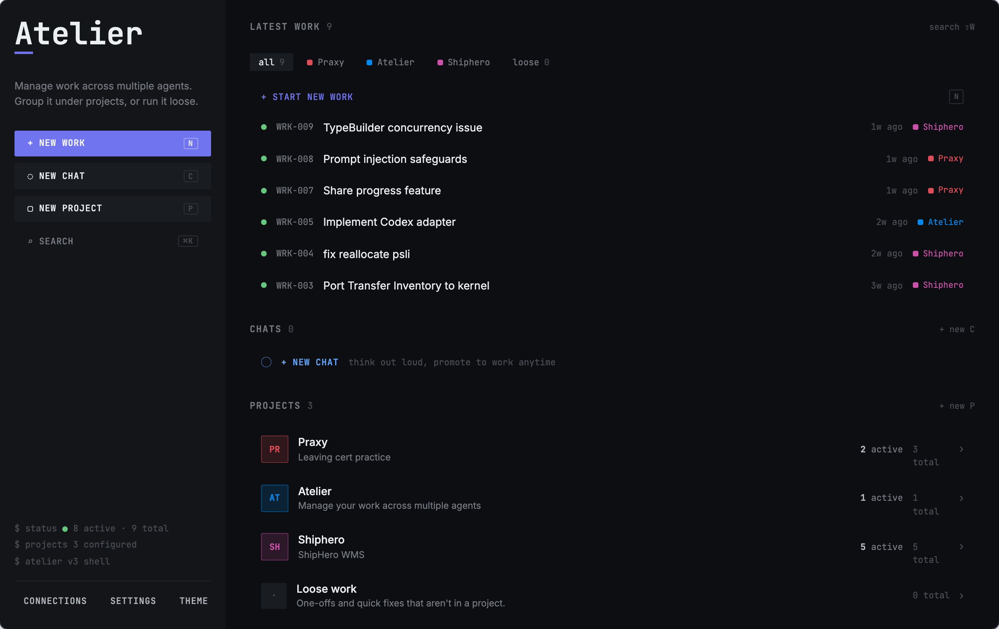
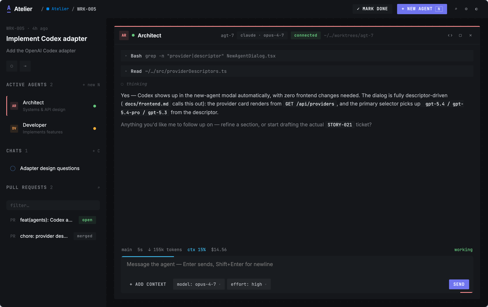
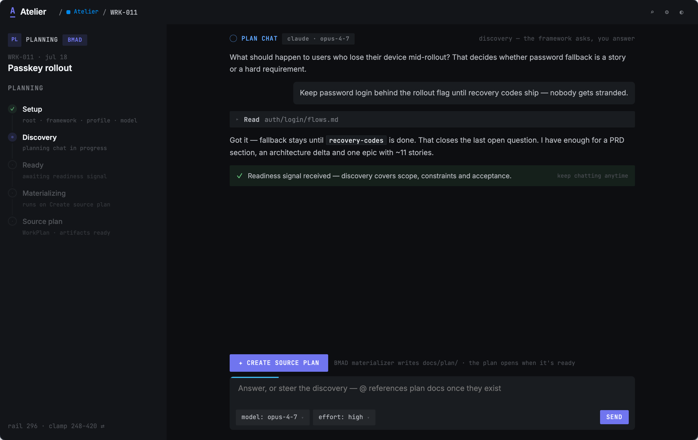
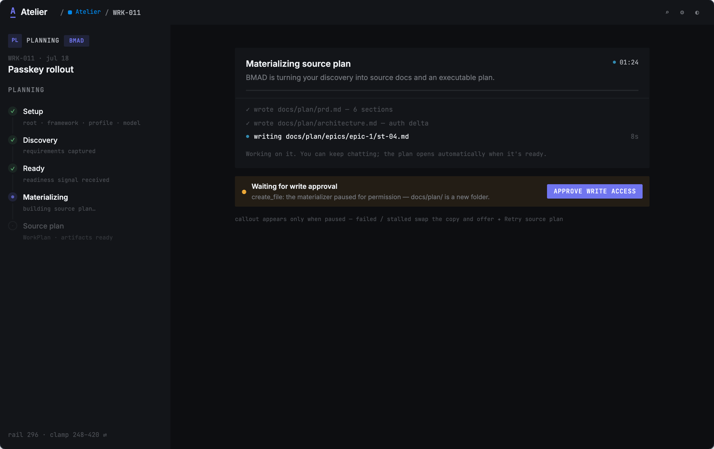
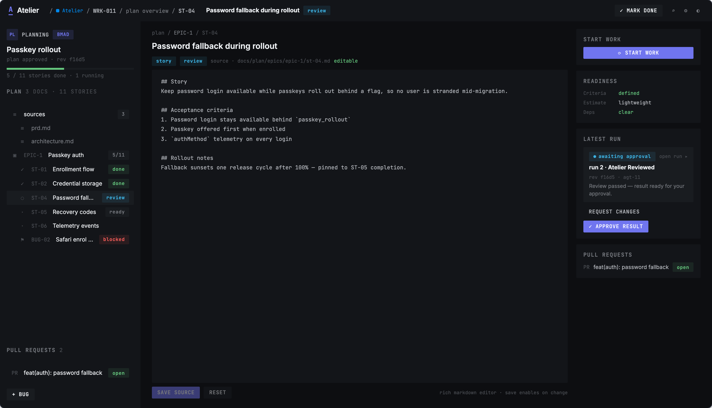
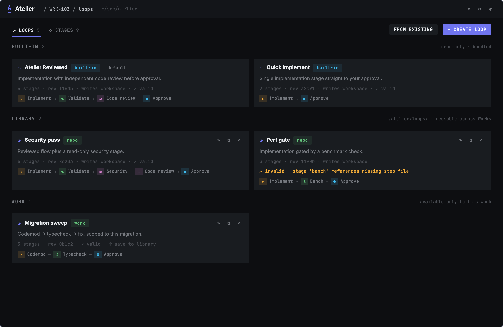
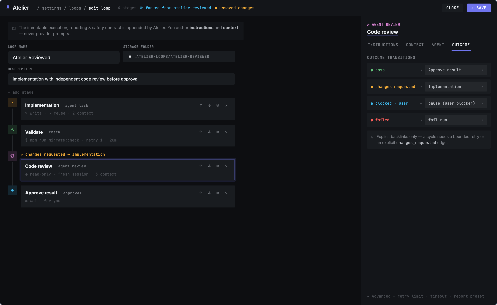
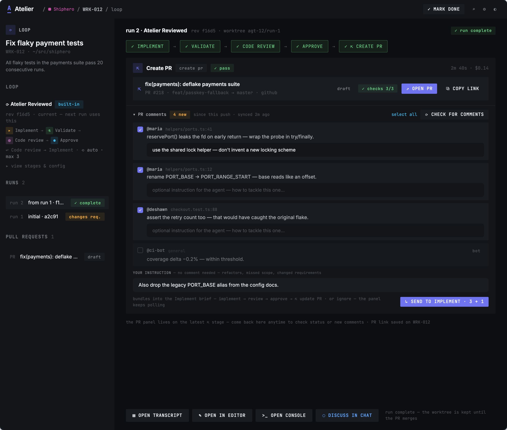
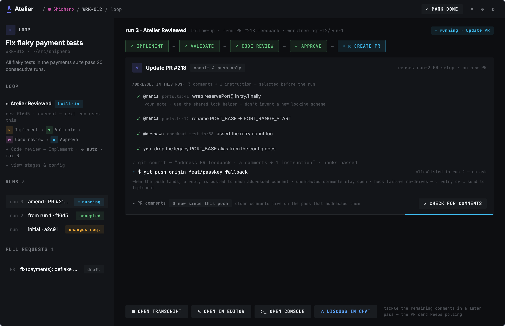

<!-- One centred container: a <p> around the mark adds GitHub's paragraph
     margin, which detaches it from the title. GitHub strips style attributes,
     so `align` is the tool available here. -->
<div align="center">
  
  <h1>Atelier</h1>
  <p><b>Manage work across multiple coding agents.</b><br>
  Group it under projects, or run it loose — plan it, loop it, ship it.</p>
</div>

---

Atelier is a workbench for agent-driven development. It keeps every piece of work you're doing — and have done — organized, durable, and reviewable: projects group related work, each work runs one or more agents, and everything survives a reboot. On top of that sit two power modes: **planning** (spec-framework-driven discovery that materializes into an executable plan) and **loops** (your own multi-stage agent pipelines with gates and reviews).

Atelier drives **Claude Code**, **Codex**, **Amp**, and **OpenCode** — pick a provider per agent. Any model not covered directly is reachable through OpenCode.

## Everything you're working on, in one place



The home screen is the ledger of your work: latest work across all projects, quick chats you can promote into work anytime, and your projects with live active/total counts. One-offs live in **Loose work** — nothing gets lost, whether it ran five minutes or five weeks ago, before or after a reboot. And `⌘K` opens global search from anywhere — jump straight to any work or project.

## The work canvas — manual mode



A work is a canvas of agent tiles. Spin up agents side by side — each with its own working directory, provider, model, and permissions — and drive them directly from the tile's composer. Tool-permission approvals appear inline in the tile's dock, right where the result will land.

## Planning mode — think first, then materialize



Start a work in planning mode and pick your spec framework — **BMAD**, **Spec-kit**, **OpenSpec**, or bring your own templates. A discovery chat walks the idea through the framework's flow, with a progress timeline and readiness gates before anything is committed.



When discovery is ready, Atelier **materializes** it: an agent turns the conversation into source-backed plan docs — intent, design guide, architecture notes, epics and stories — written as real files in your repo.

## Plan overview — epics, stories, runs



The materialized plan is a navigable tree: epics, stories, spikes, and their PRs. Each story is an editable doc backed by its source file, with readiness, latest run, and a **Start work** action in the aside — launch a scoped agent run straight from the story, and results flow back into the plan.

## Loops — your own agent pipelines



Loops are reusable multi-stage pipelines: implement → validate → review → approve, or whatever shape your workflow needs. The library ships with built-ins and holds your own loops and stages; stages are loop-independent building blocks you can share across loops.



The loop editor lets you define custom loops: agent tasks, checks, agent reviews, and human approval gates, wired together by **outcome transitions** (`pass`, `changes requested`, `blocked`, `failed`). Combine loops with your spec library — briefs pull pinned context from the loop, plans bind story context into the slots — so every run starts from a well-specified brief and agent output quality goes up.

## PR tracking — comments applied by the loop



Agents open PRs and Atelier tracks them — `draft → open → merged`, surfaced on the work's rail. Review comments sync into the run: select the ones that matter, add your own instruction, and send them back.



A follow-up pass applies the selected comments on the same branch — commit & push only, no new PR — and when the push lands, a reply is posted to each addressed comment. Unselected comments stay open for a later pass.

## Why Atelier

- **Track all your work** — everything you're doing and have done, organized in projects and works.
- **Reboot-proof** — sessions, runs, and transcripts are persisted; never lose track of work after a restart.
- **Custom loops** — encode your delivery process once, reuse it on every work.
- **Specs + loops** — pair your favorite spec framework with loops to sharpen briefs and improve agent output quality.

## Quickstart

Cloned to coordinating in about a minute. Atelier is a local web app — Python backend, Vite frontend, SQLite + NDJSON transcripts on disk. Your repos, your keys, nothing leaves your machine.

**01 · Clone and run** — one script installs deps, migrates the DB, and starts both servers.

> You'll need **Python 3.11+**, **Node 18+**, and [`uv`](https://docs.astral.sh/uv/)

```bash
git clone https://github.com/sebastiandev/atelier.git
cd atelier && ./scripts/dev.sh
```

**02 · Open the workspace** — frontend at `127.0.0.1:4173`, API at `:8001`. Create a work unit, launch agents.

Use alternate ports with `./scripts/dev.sh --fe 4183 --be 8011`.


### One-click desktop launcher

Prefer double-clicking an app icon over typing a script?

```sh
# macOS / Linux
./scripts/install-launcher.sh

# Windows (PowerShell, requires Git Bash on PATH)
powershell -ExecutionPolicy Bypass -File scripts\install-launcher.ps1
cd atelier && ./scripts/dev.sh
```

This drops an `Atelier.app` (macOS), `atelier.desktop` entry (Linux), or
Start Menu + Desktop shortcut (Windows) that launches the dev servers in a
terminal window.

## For AI Agents
For AI assistants working on the codebase, see [`CLAUDE.md`](CLAUDE.md).

## License

[Functional Source License, Version 1.1, Apache 2.0 Future License](LICENSE)
(FSL-1.1-ALv2). Plain English: use it, fork it, modify it, run it at work,
build on top of it. The one thing you can't do is package it as a competing
commercial product or hosted service. Two years after each release, the
matching version automatically converts to Apache 2.0 — fully permissive
from there on.

Quick guide:

 - Personal use, internal company use, consulting / professional services using Atelier — **fine**.
 - Forks, modifications, contributions back — **fine**.
 - "Atelier Cloud" or a paid managed service that competes with Atelier — **not allowed** during the FSL window.

If you want to do something that feels close to that line, open an issue and we'll talk.
